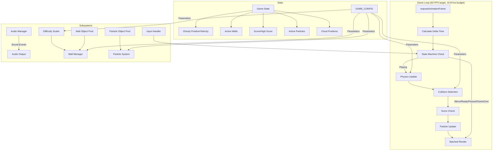
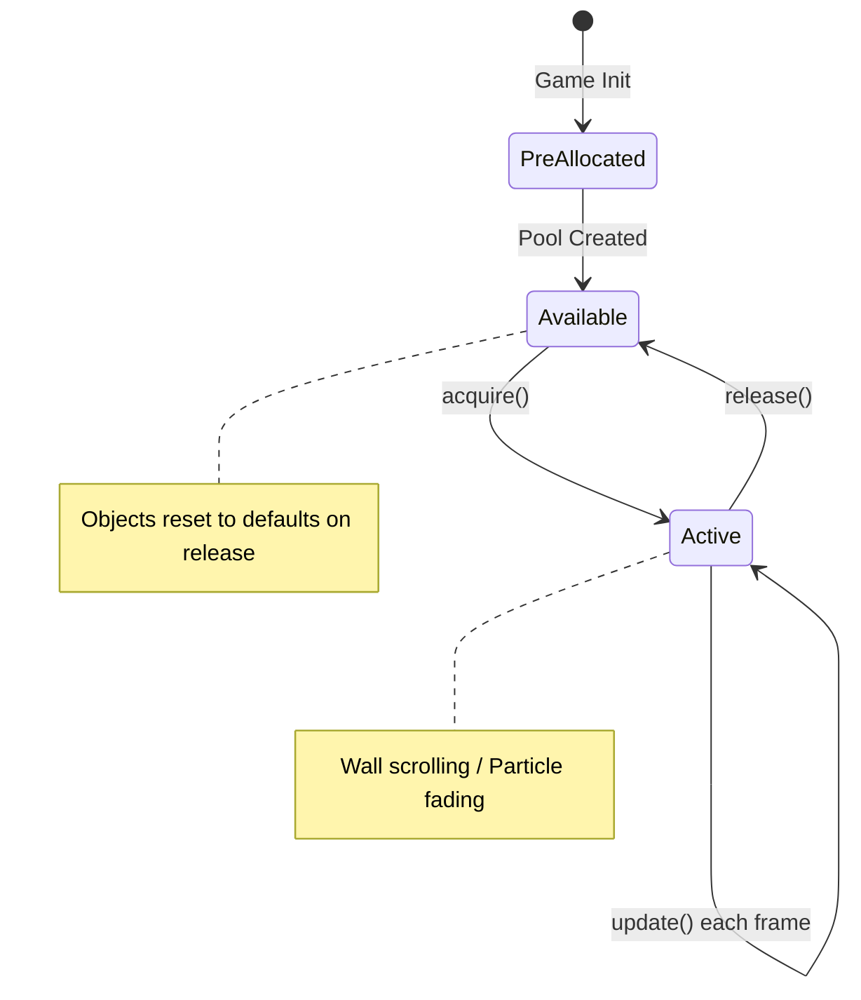

# Design Document: Flappy Kiro

## Overview

Flappy Kiro is a retro-style, endless side-scrolling browser game built with HTML5 Canvas and vanilla JavaScript. The player controls a ghost character (Ghosty) navigating through gaps between vertically-arranged wall pairs. The game features a hand-drawn visual aesthetic, progressive difficulty scaling, particle effects, parallax scrolling, and persistent high score storage.

The architecture follows a classic game loop pattern with a fixed-timestep physics simulation, frame-interpolated rendering, and an event-driven state machine. All rendering targets a single Canvas element at 400×600 logical resolution, scaled to fit the viewport with letterboxing. The game targets 60 FPS with a 16.67ms frame budget.

### Key Design Decisions

1. **Single-file architecture**: The game is small enough to ship as a single `index.html` with embedded JavaScript, avoiding build tooling complexity. Modules are logically separated as ES6 classes within the file.
2. **Centralized Game_Config**: All numerical constants, tuning values, and parameters are defined in a single `GAME_CONFIG` object at the top of the codebase. No magic numbers appear in logic code.
3. **Fixed physics timestep with render interpolation**: Physics updates at a fixed rate (60Hz) while rendering uses `requestAnimationFrame`. Interpolation between physics states eliminates visual stuttering regardless of display refresh rate.
4. **Circular hitbox for Ghosty**: Collision uses an inscribed circle within the sprite bounds rather than an AABB, providing a more forgiving and geometrically appropriate hitbox for a round ghost character. Circle-vs-rectangle intersection is used for wall collision checks.
5. **Object pooling**: Wall_Pairs and Particles are pre-allocated in pools and recycled rather than created/destroyed, minimizing garbage collection pressure and frame-time spikes.
6. **Sprite batching**: The renderer groups draw calls by type (walls → particles → UI) to minimize Canvas context state changes and improve rendering throughput.
7. **State machine for game flow**: A finite state machine governs transitions between Menu, Ready, Playing, Paused, and Game_Over states, preventing invalid state combinations.
8. **Component-based subsystems**: Physics, collision detection, rendering, audio, particles, and difficulty scaling are isolated subsystems that communicate through the game state object.

## Architecture



### Game Loop Timing Model

```mermaid
sequenceDiagram
    participant RAF as requestAnimationFrame
    participant Loop as Game Loop
    participant Physics as Physics Engine
    participant Renderer as Batched Renderer

    RAF->>Loop: callback(timestamp)
    Loop->>Loop: deltaTime = min(timestamp - lastTime, 50ms)
    Loop->>Loop: accumulator += deltaTime
    loop While accumulator >= PHYSICS_STEP (16.67ms)
        Loop->>Physics: update(PHYSICS_STEP)
        Loop->>Loop: accumulator -= PHYSICS_STEP
    end
    Loop->>Renderer: render(interpolation = accumulator / PHYSICS_STEP)
    Note over Renderer: Batch: Walls → Particles → UI
    Loop->>RAF: request next frame
```

### Object Pool Lifecycle



## Components and Interfaces

### 0. GAME_CONFIG (Centralized Configuration)

All numerical constants consolidated into a single top-level object. No subsystem embeds magic numbers.

```javascript
const GAME_CONFIG = {
    canvas: {
        width: 400,
        height: 600,
        aspectRatio: 2 / 3,
        backgroundColor: '#87CEEB',
        frameRateTarget: 60,
        frameBudgetMs: 16.67
    },

    physics: {
        gravity: 980,                    // px/s²
        flapImpulse: -300,               // px/s (negative = upward)
        terminalVelocityDown: 500,       // px/s
        terminalVelocityUp: 400,         // px/s (magnitude, stored as -400)
        maxRotationDeg: 30,              // degrees
        physicsStepMs: 16.67             // fixed timestep (60Hz)
    },

    difficulty: {
        baseWallSpeed: 120,              // px/s
        baseSpacing: 200,                // px horizontal distance between pairs
        baseGapHeight: 130,              // px vertical gap
        minGapHeight: 90,                // px minimum gap
        minSpacing: 150,                 // px minimum spacing
        speedIncrementPercent: 5,        // % increase per threshold
        speedThreshold: 5,              // points per speed increment
        maxSpeedMultiplier: 2.0,         // 200% max speed
        gapDecrementPx: 2,              // px decrease per threshold
        gapThreshold: 5,                // points per gap decrement
        spacingDecrementPx: 5,          // px decrease per threshold
        spacingThreshold: 10            // points per spacing decrement
    },

    collision: {
        ghostyHitboxRadius: null,        // Computed at init: min(spriteWidth, spriteHeight) / 2
        ghostyHitboxRadiusScale: 1.0,    // Multiplier for inscribed circle (1.0 = full inscribed)
        wallBoundingMode: 'aabb'         // Walls use axis-aligned bounding rectangles
    },

    walls: {
        width: 50,                       // px
        capOverhang: 10,                 // px cap extends beyond wall width on each side
        capHeight: 20,                   // px
        wallColor: '#2ecc40',
        capColor: '#1a7a1a',
        gapCenterMinPercent: 0.2,        // 20% of canvas height
        gapCenterMaxPercent: 0.8,        // 80% of canvas height
        gapCenterMinMargin: 60           // px from top/bottom boundary
    },

    ghosty: {
        spriteWidth: 40,                 // px (from loaded asset)
        spriteHeight: 40,                // px (from loaded asset)
        startXFraction: 0.33,            // left third of canvas
        startYFraction: 0.5,             // vertically centered
        bobAmplitude: 10,                // px for menu bobbing
        bobFrequency: 2                  // Hz for menu bobbing
    },

    particles: {
        trailCountMin: 3,
        trailCountMax: 5,
        burstCountMin: 5,
        burstCountMax: 8,
        radiusMin: 2,                    // px
        radiusMax: 4,                    // px
        initialOpacity: 0.8,
        lifetimeMs: 400,
        spawnOffsetY: 3,                 // ±px random vertical offset
        color: '#FFFFFF',
        poolSize: 100                    // pre-allocated particle pool size
    },

    pools: {
        wallPairPoolSize: 10,            // pre-allocated wall pair pool
        particlePoolSize: 100            // pre-allocated particle pool
    },

    rendering: {
        deltaTimeCap: 50,                // ms max delta-time
        screenShakeAmplitude: 5,         // px
        screenShakeDuration: 300,        // ms
        tumbleRotation: 360,             // degrees
        tumbleDuration: 500,             // ms
        whiteFlashOpacity: 0.5,
        whiteFlashDuration: 100,         // ms
        scorePopupRise: 30,              // px
        scorePopupDuration: 600,         // ms
        invincibilityDuration: 1000,     // ms
        invincibilityPulseInterval: 100, // ms
        invincibilityMinOpacity: 0.5,
        invincibilityMaxOpacity: 1.0,
        gameOverDebounce: 500,           // ms
        newRecordFlashDuration: 500,     // ms
        newRecordFlashColor: '#FFD700',
        hudScoreOpacity: 0.3
    },

    clouds: {
        layerCount: 3,
        speedFactors: [0.2, 0.4, 0.6],  // fraction of wall speed per layer
        minOpacity: 0.3,
        maxOpacity: 0.7,
        spawnRegionFraction: 0.66        // upper 2/3 of canvas
    },

    audio: {
        jumpSound: 'assets/jump.wav',
        gameOverSound: 'assets/game_over.wav',
        scoreSound: null,                // Generated or embedded chime
        masterVolume: 1.0,
        sfxVolume: 0.8
    }
};
```

### 1. GameEngine (Main Controller)

The top-level coordinator that owns the game loop and orchestrates all subsystems.

```javascript
class GameEngine {
    constructor(canvasElement)

    // Lifecycle
    init(): Promise<void>          // Load assets, initialize subsystems, compute hitbox radius
    start(): void                  // Begin the game loop

    // Game Loop
    loop(timestamp: number): void  // Main loop callback
    update(dt: number): void       // Physics + logic update
    render(interpolation: number): void  // Draw frame (batched)

    // State
    canvas: HTMLCanvasElement
    ctx: CanvasRenderingContext2D
    config: typeof GAME_CONFIG
    stateMachine: StateMachine
    physics: PhysicsEngine
    wallManager: WallManager
    collisionDetector: CollisionDetector
    scoreManager: ScoreManager
    audioManager: AudioManager
    particleSystem: ParticleSystem
    cloudSystem: CloudSystem
    renderer: Renderer
    inputHandler: InputHandler
    wallPool: ObjectPool<WallPair>
    particlePool: ObjectPool<Particle>
}
```

### 2. StateMachine

Manages game state transitions with validation.

```javascript
class StateMachine {
    constructor()

    currentState: GameState        // Current state enum value
    previousState: GameState       // For resume from pause

    transition(newState: GameState): boolean  // Returns false if invalid transition
    canTransition(from: GameState, to: GameState): boolean
    onEnter(state: GameState): void   // State entry hooks
    onExit(state: GameState): void    // State exit hooks
}

// Valid transitions:
// Menu -> Ready
// Ready -> Playing
// Playing -> Paused
// Playing -> Game_Over
// Paused -> Playing
// Game_Over -> Playing
```

### 3. PhysicsEngine

Handles gravity, velocity, position updates, and terminal velocity enforcement. All parameters read from `GAME_CONFIG.physics`.

```javascript
class PhysicsEngine {
    constructor(config: typeof GAME_CONFIG.physics)

    update(ghosty: GhostyState, dt: number): void
    applyFlap(ghosty: GhostyState): void
    applyGravity(ghosty: GhostyState, dt: number): void
    clampVelocity(ghosty: GhostyState): void
    clampPosition(ghosty: GhostyState, canvasHeight: number): void
    interpolatePosition(ghosty: GhostyState, alpha: number): {x: number, y: number}
    calculateRotation(vy: number): number  // Returns clamped rotation degrees
}
```

### 4. ObjectPool\<T\>

Generic pre-allocated pool for reusable game objects. Used for Wall_Pairs and Particles.

```javascript
class ObjectPool<T> {
    constructor(factory: () => T, reset: (obj: T) => void, initialSize: number)

    pool: T[]                     // Available objects
    active: T[]                   // Currently in-use objects

    acquire(): T                  // Get object from pool (or create overflow)
    release(obj: T): void         // Return object to pool after reset
    releaseAll(): void            // Return all active objects to pool
    getActive(): T[]              // Get all currently active objects
    getAvailableCount(): number   // Objects ready for reuse
    getActiveCount(): number      // Objects currently in use
}
```

**Invariants:**
- `pool.length + active.length >= initialSize` (total objects never shrink below initial allocation)
- An object cannot be in both `pool` and `active` simultaneously
- `release()` calls the `reset` function before returning to pool
- `acquire()` returns from pool if available, creates new only if pool is empty

### 5. WallManager

Generates, positions, scrolls, and removes wall pairs. Acquires/releases from ObjectPool instead of creating/destroying.

```javascript
class WallManager {
    constructor(config: typeof GAME_CONFIG.walls, pool: ObjectPool<WallPair>)

    update(dt: number, difficulty: DifficultyState): void
    spawnWall(canvasHeight: number, difficulty: DifficultyState): WallPair  // Acquires from pool
    recycleOffscreen(): void      // Releases off-screen walls back to pool
    reset(): void                 // Releases all walls back to pool
    getActiveWalls(): WallPair[]
}
```

### 6. CollisionDetector

Uses **circle-vs-rectangle intersection** for Ghosty (circular hitbox) against wall AABBs. The collision radius is the inscribed circle within the sprite dimensions: `radius = min(spriteWidth, spriteHeight) / 2 * radiusScale`.

```javascript
class CollisionDetector {
    constructor(config: typeof GAME_CONFIG.collision)

    checkCollision(ghosty: GhostyState, walls: WallPair[]): CollisionResult
    checkBoundary(ghosty: GhostyState, scoreBarTop: number): CollisionResult

    // Circle-vs-AABB intersection:
    // 1. Find nearest point on rectangle to circle center
    // 2. Compute distance from circle center to that point
    // 3. Collision if distance < radius
    static circleRectIntersects(circle: Circle, rect: Rect): boolean

    // Compute Ghosty's circular hitbox from position and config
    getCircularHitbox(ghosty: GhostyState): Circle
}

interface Circle {
    cx: number      // center x
    cy: number      // center y
    radius: number  // collision radius
}

interface CollisionResult {
    collided: boolean
    type: 'wall' | 'floor' | 'none'
    wallPair?: WallPair
}
```

**Circle-vs-Rectangle Algorithm:**
```
function circleRectIntersects(circle, rect):
    // Find the closest point on the rectangle to the circle center
    closestX = clamp(circle.cx, rect.x, rect.x + rect.width)
    closestY = clamp(circle.cy, rect.y, rect.y + rect.height)

    // Compute distance from circle center to closest point
    dx = circle.cx - closestX
    dy = circle.cy - closestY
    distanceSquared = dx * dx + dy * dy

    // Collision if distance < radius
    return distanceSquared < circle.radius * circle.radius
```

### 7. ScoreManager

Tracks current score, high score, persistence, and score events.

```javascript
class ScoreManager {
    constructor(storageKey: string)

    currentScore: number
    highScore: number
    scoredWalls: Set<number>     // IDs of walls already scored
    isNewRecord: boolean
    newRecordFlashTimer: number

    checkScore(ghosty: GhostyState, walls: WallPair[]): boolean  // Returns true if scored
    updateHighScore(): void
    reset(): void
    loadHighScore(): number
    saveHighScore(): void
}
```

### 8. AudioManager

Preloads and plays sound effects with graceful fallback. Volume levels read from `GAME_CONFIG.audio`.

```javascript
class AudioManager {
    constructor(config: typeof GAME_CONFIG.audio)

    sounds: Map<string, HTMLAudioElement>
    loaded: boolean

    preload(assets: AudioAsset[]): Promise<void>
    play(soundName: string): void
    playLoop(soundName: string): void
    stop(soundName: string): void
    stopAll(): void
}

interface AudioAsset {
    name: string
    path: string
}
```

### 9. ParticleSystem

Manages trail particles and burst effects. Acquires/releases from ObjectPool instead of creating/destroying.

```javascript
class ParticleSystem {
    constructor(config: typeof GAME_CONFIG.particles, pool: ObjectPool<Particle>)

    update(dt: number): void
    emitTrail(x: number, y: number): void      // Acquires 3-5 particles from pool
    emitBurst(x: number, y: number): void      // Acquires 5-8 particles from pool
    recycleExpired(): void                      // Releases faded particles back to pool
    reset(): void                              // Releases all particles back to pool
    getActiveParticles(): Particle[]
}

interface Particle {
    x: number
    y: number
    vx: number
    vy: number
    radius: number          // 2-4 px
    opacity: number         // starts at 0.8, fades to 0
    lifetime: number        // 400ms total
    elapsed: number
    active: boolean         // pool management flag
}
```

### 10. CloudSystem

Parallax-scrolling decorative clouds at multiple depth layers. Parameters from `GAME_CONFIG.clouds`.

```javascript
class CloudSystem {
    constructor(config: typeof GAME_CONFIG.clouds)

    clouds: Cloud[]

    update(dt: number, wallSpeed: number): void
    render(ctx: CanvasRenderingContext2D): void
    spawnCloud(layer: number): Cloud
    reset(): void
}
```

### 11. Renderer (Sprite Batching)

Handles all Canvas drawing with **batched draw calls** grouped by type. Minimizes `ctx.save()`/`ctx.restore()` and state changes (fillStyle, globalAlpha, transforms) by drawing all objects of the same type in sequence.

```javascript
class Renderer {
    constructor(ctx: CanvasRenderingContext2D, assets: GameAssets, config: typeof GAME_CONFIG.rendering)

    render(state: RenderState): void

    // Batched render pipeline (called in this order):
    renderBackground(): void                   // Single fill + texture overlay
    renderClouds(clouds: Cloud[]): void         // Batch: all clouds, shared alpha/fill
    renderWalls(walls: WallPair[]): void        // Batch: all walls same fillStyle, then all caps
    renderScoreBubbles(walls: WallPair[]): void // Batch: all bubbles
    renderGhosty(ghosty: GhostyState, interpolation: number): void  // Single sprite draw
    renderParticles(particles: Particle[]): void // Batch: all particles same fill/alpha
    renderScorePopups(popups: ScorePopup[]): void
    renderHUD(score: number, state: GameState): void
    renderScoreDisplay(score: number, highScore: number): void

    // State-specific overlays
    renderMenuScreen(highScore: number, bobOffset: number): void
    renderReadyScreen(): void
    renderPauseOverlay(): void
    renderGameOverScreen(score: number, highScore: number): void

    // Effects
    applyScreenShake(shake: ScreenShakeState): void
    applyHandDrawnStyle(): void
}
```

**Batching Strategy:**
- Walls: Set `ctx.fillStyle` to wall color once, draw all wall bodies. Then set cap color once, draw all caps.
- Particles: Set `ctx.fillStyle` to white once, iterate particles only changing `globalAlpha` per particle.
- UI elements: Group text draws, minimize font/fillStyle changes.
- Avoid `ctx.save()`/`ctx.restore()` inside tight loops; manually restore only changed properties.

### 12. InputHandler

Unified input handling for mouse, keyboard, and touch.

```javascript
class InputHandler {
    constructor(canvas: HTMLCanvasElement)

    onAction: (action: InputAction) => void  // Callback for game actions

    bindEvents(): void
    unbindEvents(): void

    // Handles: click, touchstart, keydown (space, P, Escape)
}

type InputAction = 'flap' | 'pause' | 'resume'
```

### 13. DifficultyScaler

Calculates difficulty parameters based on current score. All thresholds and bounds from `GAME_CONFIG.difficulty`.

```javascript
class DifficultyScaler {
    constructor(config: typeof GAME_CONFIG.difficulty)

    calculate(score: number): DifficultyState
    reset(): void
}
```

## Data Models

### Core Game State

```javascript
interface GameState {
    phase: 'Menu' | 'Ready' | 'Playing' | 'Paused' | 'Game_Over'
}

interface GhostyState {
    x: number                    // Horizontal position (fixed during gameplay)
    y: number                    // Vertical position (updated by physics)
    vy: number                   // Vertical velocity (px/s)
    prevY: number                // Previous frame Y for interpolation
    rotation: number             // Current rotation angle (degrees)
    width: number                // Sprite width
    height: number               // Sprite height
    hitboxRadius: number         // Circular hitbox radius (inscribed circle)
    invincibleTimer: number      // Remaining invincibility ms (0 = vulnerable)
    bobOffset: number            // Menu bob animation offset
}
```

### Wall Data

```javascript
interface WallPair {
    id: number                   // Unique identifier for scoring tracking
    x: number                    // Horizontal position (left edge)
    gapCenterY: number           // Vertical center of the gap
    gapHeight: number            // Height of the gap
    scored: boolean              // Whether this wall has been scored
    width: number                // Wall width in pixels
    active: boolean              // Pool management flag
}

// Derived bounding boxes (AABBs for walls):
// Top wall:    { x: wall.x, y: 0, width: wall.width, height: gapCenterY - gapHeight/2 }
// Bottom wall: { x: wall.x, y: gapCenterY + gapHeight/2, width: wall.width, height: canvasHeight - (gapCenterY + gapHeight/2) }
```

### Geometry

```javascript
interface Circle {
    cx: number                   // Center X
    cy: number                   // Center Y
    radius: number               // Collision radius
}

interface Rect {
    x: number
    y: number
    width: number
    height: number
}

interface Cloud {
    x: number
    y: number
    width: number
    height: number
    layer: number                // 0, 1, or 2
    opacity: number              // 0.3 to 0.7
    speedFactor: number          // Derived from layer
}
```

### Visual Effect State

```javascript
interface ScreenShakeState {
    active: boolean
    amplitude: number            // 5 px (from GAME_CONFIG)
    duration: number             // 300 ms (from GAME_CONFIG)
    elapsed: number
}

interface ScorePopup {
    x: number
    y: number
    opacity: number              // 1.0 -> 0.0
    offsetY: number              // rises 30px
    lifetime: number             // 600ms (from GAME_CONFIG)
    elapsed: number
}

interface CollisionAnimation {
    active: boolean
    rotation: number             // 0 -> 360 degrees
    duration: number             // 500ms (from GAME_CONFIG)
    elapsed: number
}

interface WhiteFlash {
    active: boolean
    opacity: number              // 0.5 -> 0.0
    duration: number             // 100ms (from GAME_CONFIG)
    elapsed: number
}
```

### Difficulty State

```javascript
interface DifficultyState {
    speedMultiplier: number      // 1.0 to 2.0
    gapHeight: number            // 130 down to 90
    spacing: number              // 200 down to 150
    currentSpeed: number         // baseSpeed * speedMultiplier
}
```

### Asset References

```javascript
interface GameAssets {
    ghostySprite: HTMLImageElement | null   // assets/ghosty.png
    sounds: {
        jump: string             // assets/jump.wav
        gameOver: string         // assets/game_over.wav
        score: string            // Generated or embedded chime
    }
}
```


## Correctness Properties

*A property is a characteristic or behavior that should hold true across all valid executions of a system—essentially, a formal statement about what the system should do. Properties serve as the bridge between human-readable specifications and machine-verifiable correctness guarantees.*

### Property 1: Gravity Application

*For any* initial vertical velocity and any positive delta-time, applying gravity should increase the vertical velocity by exactly `gravity * dt` (before terminal velocity clamping).

**Validates: Requirements 2.1**

### Property 2: Flap Impulse Assignment

*For any* initial vertical velocity state, applying a flap should set the vertical velocity to exactly the configured flapImpulse value (-300 px/s upward), regardless of the prior velocity value.

**Validates: Requirements 2.2**

### Property 3: Terminal Velocity Clamping

*For any* vertical velocity value, after clamping: the downward velocity shall not exceed 500 px/s, and the upward velocity (negative) shall not exceed -400 px/s in magnitude. Velocities within the valid range remain unchanged.

**Validates: Requirements 2.5, 2.6**

### Property 4: Top Boundary Position Constraint

*For any* ghosty position at or above zero (y <= 0), the position shall be clamped to zero and the velocity shall be set to zero if it is negative (upward). Positions below zero remain unchanged.

**Validates: Requirements 2.7, 4.7**

### Property 5: Movement Interpolation

*For any* previous position, current position, and interpolation factor alpha in [0, 1], the rendered position shall equal `prevY + (currentY - prevY) * alpha`.

**Validates: Requirements 2.8**

### Property 6: Rotation Angle Clamping

*For any* vertical velocity, the computed rotation angle shall be within [-30, 30] degrees, positive (downward tilt) for positive velocity, and negative (upward tilt) for negative velocity.

**Validates: Requirements 2.9**

### Property 7: Wall Pair Horizontal Spacing

*For any* sequence of generated wall pairs, the horizontal distance between consecutive wall pairs shall equal the current spacing value from the difficulty scaler.

**Validates: Requirements 3.1**

### Property 8: Wall Scroll Position Update

*For any* wall position, scroll speed, and positive delta-time, the new position shall equal `x - speed * dt`.

**Validates: Requirements 3.2**

### Property 9: Gap Center Constraint

*For any* generated wall pair on a 600px-high canvas, the gap center Y coordinate shall be within [120, 480] (20% to 80% of canvas height), ensuring at least 60 pixels from both the top and bottom boundaries.

**Validates: Requirements 3.3**

### Property 10: Offscreen Wall Removal

*For any* set of wall pairs, after removal processing, no wall pair with `x + width < 0` shall remain in the active set, and all wall pairs with `x + width >= 0` shall be preserved.

**Validates: Requirements 3.5**

### Property 11: Difficulty Scaling Formulas

*For any* score value: the speed multiplier shall equal `min(1.0 + floor(score / 5) * 0.05, 2.0)`, the gap height shall equal `max(130 - floor(score / 5) * 2, 90)`, and the spacing shall equal `max(200 - floor(score / 10) * 5, 150)`.

**Validates: Requirements 3.7, 3.8, 3.9**

### Property 12: Circular Hitbox Calculation

*For any* sprite width and height, the circular hitbox shall have center at `(x + width/2, y + height/2)` and radius equal to `min(width, height) / 2 * radiusScale`, where radiusScale is from GAME_CONFIG.

**Validates: Requirements 4.1**

### Property 13: Circle-vs-Rectangle Collision Detection Correctness

*For any* circle (center, radius) and axis-aligned rectangle, the collision detector shall return true if and only if the distance from the circle center to the nearest point on the rectangle is less than the circle's radius. Specifically: `(clamp(cx, rect.x, rect.x+w) - cx)² + (clamp(cy, rect.y, rect.y+h) - cy)² < radius²`.

**Validates: Requirements 4.2**

### Property 14: Score-Once-Per-Wall Invariant

*For any* wall pair and any number of frames during which ghosty's center is past the wall's right edge, the score shall be incremented by exactly one for that wall pair.

**Validates: Requirements 5.1**

### Property 15: High Score Update

*For any* current score and stored high score, after the update operation the high score shall equal `max(currentScore, storedHighScore)`.

**Validates: Requirements 5.5**

### Property 16: Pause Freezes All State

*For any* game state (ghosty position/velocity, wall positions, score, particles), advancing time while paused shall produce an identical state—no positions, velocities, or scores change.

**Validates: Requirements 6.2**

### Property 17: Game Reset Invariants

*For any* pre-reset game state, after reset: the current score shall be zero, the high score shall be unchanged, the invincibility timer shall be 1000ms, Ghosty's velocity shall be zero, and no active wall pairs shall remain.

**Validates: Requirements 6.9, 6.10, 6.11, 6.13**

### Property 18: Particle Opacity Fade

*For any* particle with lifetime 400ms, the opacity at time t shall equal `0.8 * (1 - t / 400)`, reaching zero at t = 400ms. Particles with elapsed >= lifetime are released back to the pool.

**Validates: Requirements 7.4**

### Property 19: Particle Spawn Constraints

*For any* spawned trail particle, its radius shall be in [2, 4] pixels and its vertical offset from Ghosty's trailing edge shall be in [-3, 3] pixels.

**Validates: Requirements 7.5**

### Property 20: Flap Burst Particle Count

*For any* flap event, the number of burst particles emitted shall be in [5, 8] inclusive.

**Validates: Requirements 7.6**

### Property 21: Canvas Aspect Ratio Preservation

*For any* viewport width and height, the scaled canvas dimensions shall maintain a 2:3 aspect ratio (400:600), fitting within the viewport without exceeding either dimension.

**Validates: Requirements 8.4**

### Property 22: Cloud System Constraints

*For any* cloud in the system: its opacity shall be in [0.3, 0.7], its Y position shall be in the upper two-thirds of the canvas (y <= 400), it shall be assigned to one of at least 3 depth layers, and clouds in deeper layers (farther) shall move slower than clouds in shallower layers (nearer), all moving slower than the wall scroll speed.

**Validates: Requirements 8.6, 8.7, 8.8**

### Property 23: Delta-Time Capping

*For any* elapsed time between frames, the delta-time used for updates shall equal `min(elapsed, 50)` milliseconds.

**Validates: Requirements 9.2**

### Property 24: Object Pool Acquire-Release Invariant

*For any* sequence of acquire and release operations on an ObjectPool, the following invariants hold: (1) the total number of objects (available + active) never decreases below the initial pool size, (2) an acquired object is not available for re-acquisition until released, (3) releasing an object resets it to default state and makes it available for acquisition, and (4) acquiring when the pool is non-empty returns an existing object without allocation.

**Validates: Requirements 11.1, 11.2**

## Error Handling

### Asset Loading Failures

| Error | Handling Strategy | User Impact |
|-------|------------------|-------------|
| `ghosty.png` fails to load | Display error message on canvas; block transition to Ready state | Player cannot start until asset loads or page reloads |
| `ghosty.png` loaded late | Render white circle fallback until sprite available | Minor visual glitch, gameplay unaffected |
| `jump.wav` fails to load | Log warning, continue without jump sound | Reduced audio feedback |
| `game_over.wav` fails to load | Log warning, continue without game over sound | Reduced audio feedback |
| Score sound fails to load | Log warning, continue without score sound | Reduced audio feedback |

### Runtime Errors

| Error | Handling Strategy | User Impact |
|-------|------------------|-------------|
| `localStorage` unavailable | Default high score to 0; skip persistence | Scores not saved across sessions |
| `localStorage` value corrupted (NaN, invalid) | Default high score to 0; overwrite on next save | Previous high score lost |
| Frame time spike (>50ms) | Cap delta-time at 50ms | Prevents physics tunneling; brief perceived slowdown |
| Browser tab loses focus | Auto-pause if Playing | Game state preserved |
| Audio context blocked by browser | Catch play() promise rejection; continue silently | No sound until user interaction unlocks audio |
| Object pool exhausted | Create overflow instance (not pooled) | Brief GC spike, auto-recovers |

### Defensive Patterns

- **Null sprite guard**: Check `ghostySprite` before `drawImage`; fall back to circle render.
- **Audio play guard**: Wrap all `play()` calls in try-catch since browsers may reject before user gesture.
- **NaN velocity guard**: If `vy` becomes NaN (e.g., from corrupted state), reset to 0.
- **Pool overflow protection**: If pool is empty on acquire, create a new instance but log a warning for tuning the pool size.
- **Wall array bounds**: Always filter walls before collision checks to avoid stale references.
- **Score deduplication**: Use a `scored: boolean` flag on each WallPair and a Set of scored IDs as dual protection against double-counting.
- **Config immutability**: Freeze `GAME_CONFIG` after definition to prevent accidental mutation during gameplay.

## Testing Strategy

### Unit Tests (Example-Based)

Unit tests cover specific scenarios, UI states, and integration points:

- **State transitions**: Verify all valid transitions (Menu→Ready, Ready→Playing, Playing→Paused, etc.) and reject invalid ones.
- **Game reset**: Verify Ghosty returns to default position, walls cleared, score zeroed, high score preserved.
- **Debounce**: Verify Game_Over ignores input within 500ms, accepts after.
- **Tab focus**: Verify visibility change triggers auto-pause.
- **Rendering batching**: Verify draw calls are grouped by type (walls together, particles together, UI together).
- **Config structure**: Verify GAME_CONFIG contains all expected keys and subsystem reads from config.
- **Error paths**: Verify fallback behavior on asset load failures and localStorage errors.
- **Pool overflow**: Verify graceful handling when pool is exhausted.

### Property-Based Tests

Property-based tests validate universal correctness using the [fast-check](https://github.com/dubzzz/fast-check) library for JavaScript.

**Configuration:**
- Minimum 100 iterations per property test
- Each test tagged with: `Feature: flappy-kiro, Property {N}: {title}`

**Properties to implement:**

| Property | Core Logic Under Test |
|----------|----------------------|
| 1-6 | Physics engine (gravity, flap, clamping, boundary, interpolation, rotation) |
| 7-10 | Wall management (spacing, scrolling, gap placement, removal) |
| 11 | Difficulty scaler (all three formulas) |
| 12-13 | Collision detection (circular hitbox calculation, circle-rect intersection) |
| 14-15 | Scoring (once-per-wall, high score update) |
| 16-17 | State management (pause freeze, reset invariants) |
| 18-20 | Particle system (fade, spawn constraints, burst count) |
| 21-22 | Rendering (aspect ratio, cloud constraints) |
| 23 | Game loop (delta-time capping) |
| 24 | Object pool (acquire/release invariant) |

### Integration Tests

- **Full game cycle**: Start → Menu → Ready → Playing → Score → Game_Over → Restart loop.
- **Audio integration**: Verify sounds play at correct game events (with mocked Audio API).
- **LocalStorage round-trip**: Save high score, reload page (simulated), verify persistence.
- **Viewport scaling**: Resize viewport, verify canvas maintains aspect ratio and centering.
- **Pool recycling**: Verify walls returned to pool on off-screen, particles returned on expiry.

### Test Framework

- **Library**: fast-check (property-based testing for JavaScript)
- **Runner**: Vitest with jsdom environment for Canvas/DOM mocking
- **Pattern**: Extract pure logic functions (physics, collision, difficulty math, pool operations) into testable modules that don't depend on Canvas or DOM.
