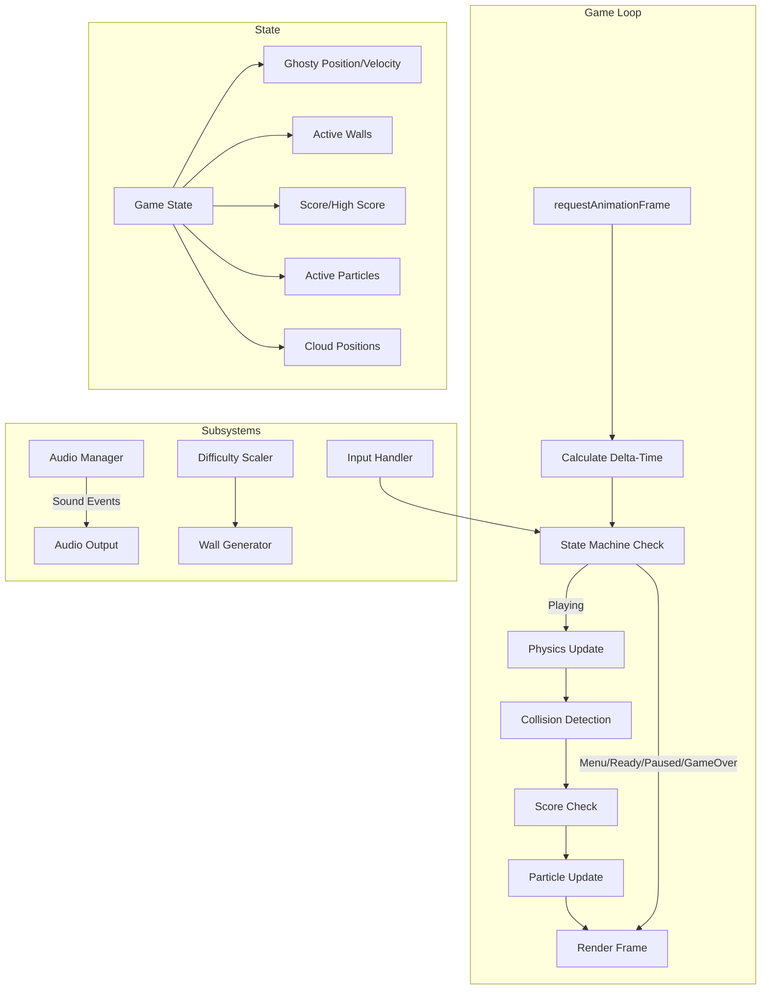

# Design Document: Flappy Kiro

## Overview

Flappy Kiro is a retro-style, endless side-scrolling browser game built with HTML5 Canvas and vanilla JavaScript. The player controls a ghost character (Ghosty) navigating through gaps between vertically-arranged wall pairs. The game features a hand-drawn visual aesthetic, progressive difficulty scaling, particle effects, parallax scrolling, and persistent high score storage.

The architecture follows a classic game loop pattern with a fixed-timestep physics simulation, frame-interpolated rendering, and an event-driven state machine. All rendering targets a single Canvas element at 400×600 logical resolution, scaled to fit the viewport with letterboxing.

### Key Design Decisions

1. **Single-file architecture**: The game is small enough to ship as a single `index.html` with embedded JavaScript, avoiding build tooling complexity. Modules are logically separated as ES6 classes within the file.
2. **Fixed physics timestep with render interpolation**: Physics updates at a fixed rate (e.g., 60Hz) while rendering uses `requestAnimationFrame`. Interpolation between physics states eliminates visual stuttering regardless of display refresh rate.
3. **State machine for game flow**: A finite state machine governs transitions between Menu, Ready, Playing, Paused, and Game_Over states, preventing invalid state combinations.
4. **Component-based subsystems**: Physics, collision detection, rendering, audio, particles, and difficulty scaling are isolated subsystems that communicate through the game state object.

## Architecture



### Game Loop Timing Model

```mermaid
sequenceDiagram
    participant RAF as requestAnimationFrame
    participant Loop as Game Loop
    participant Physics as Physics Engine
    participant Renderer as Renderer

    RAF->>Loop: callback(timestamp)
    Loop->>Loop: deltaTime = timestamp - lastTime (capped at 50ms)
    Loop->>Loop: accumulator += deltaTime
    loop While accumulator >= PHYSICS_STEP
        Loop->>Physics: update(PHYSICS_STEP)
        Loop->>Loop: accumulator -= PHYSICS_STEP
    end
    Loop->>Renderer: render(interpolation = accumulator / PHYSICS_STEP)
    Loop->>RAF: request next frame
```

## Components and Interfaces

### 1. GameEngine (Main Controller)

The top-level coordinator that owns the game loop and orchestrates all subsystems.

```javascript
class GameEngine {
    constructor(canvasElement)
    
    // Lifecycle
    init(): Promise<void>          // Load assets, initialize subsystems
    start(): void                  // Begin the game loop
    
    // Game Loop
    loop(timestamp: number): void  // Main loop callback
    update(dt: number): void       // Physics + logic update
    render(interpolation: number): void  // Draw frame
    
    // State
    canvas: HTMLCanvasElement
    ctx: CanvasRenderingContext2D
    stateMachine: StateMachine
    physics: PhysicsEngine
    wallManager: WallManager
    collisionDetector: CollisionDetector
    scoreManager: ScoreManager
    audioManager: AudioManager
    particleSystem: ParticleSystem
    cloudSystem: CloudSystem
    renderer: Renderer
    inputHandler: InputHandler
}
```

### 2. StateMachine

Manages game state transitions with validation.

```javascript
class StateMachine {
    constructor()
    
    currentState: GameState        // Current state enum value
    previousState: GameState       // For resume from pause
    
    transition(newState: GameState): boolean  // Returns false if invalid transition
    canTransition(from: GameState, to: GameState): boolean
    onEnter(state: GameState): void   // State entry hooks
    onExit(state: GameState): void    // State exit hooks
}

// Valid transitions:
// Menu -> Ready
// Ready -> Playing
// Playing -> Paused
// Playing -> Game_Over
// Paused -> Playing
// Game_Over -> Playing
```

### 3. PhysicsEngine

Handles gravity, velocity, position updates, and terminal velocity enforcement.

```javascript
class PhysicsEngine {
    constructor(config: PhysicsConfig)
    
    update(ghosty: GhostyState, dt: number): void
    applyFlap(ghosty: GhostyState): void
    applyGravity(ghosty: GhostyState, dt: number): void
    clampVelocity(ghosty: GhostyState): void
    clampPosition(ghosty: GhostyState, canvasHeight: number): void
    interpolatePosition(ghosty: GhostyState, alpha: number): {x: number, y: number}
}

interface PhysicsConfig {
    gravity: 980,              // px/s²
    flapImpulse: -300,         // px/s (negative = upward)
    terminalVelocityDown: 500, // px/s
    terminalVelocityUp: 400,   // px/s
    maxRotation: 30            // degrees
}
```

### 4. WallManager

Generates, positions, scrolls, and removes wall pairs.

```javascript
class WallManager {
    constructor(config: WallConfig)
    
    walls: WallPair[]
    
    update(dt: number, difficulty: DifficultyState): void
    spawnWall(canvasHeight: number, difficulty: DifficultyState): WallPair
    removeOffscreen(): void
    reset(): void
    getActiveWalls(): WallPair[]
}

interface WallConfig {
    baseSpeed: 120,            // px/s
    baseSpacing: 200,          // px horizontal gap between pairs
    baseGapHeight: 130,        // px vertical gap
    minGapHeight: 90,          // px minimum gap
    minSpacing: 150,           // px minimum horizontal spacing
    wallWidth: 50,             // px
    capOverhang: 10,           // px cap extends beyond wall width
    capHeight: 20,             // px
    wallColor: '#2ecc40',
    capColor: '#1a7a1a'
}
```

### 5. CollisionDetector

Checks AABB overlap between the forgiving ghosty hitbox and wall rectangles.

```javascript
class CollisionDetector {
    constructor(hitboxScale: number)  // 0.7 for 70% hitbox
    
    checkCollision(ghosty: GhostyState, walls: WallPair[]): CollisionResult
    checkBoundary(ghosty: GhostyState, scoreBarTop: number): CollisionResult
    getHitbox(ghosty: GhostyState): Rect
    
    // AABB intersection test
    static intersects(a: Rect, b: Rect): boolean
}

interface CollisionResult {
    collided: boolean
    type: 'wall' | 'floor' | 'none'
    wallPair?: WallPair
}
```

### 6. ScoreManager

Tracks current score, high score, persistence, and score events.

```javascript
class ScoreManager {
    constructor(storageKey: string)
    
    currentScore: number
    highScore: number
    scoredWalls: Set<number>     // IDs of walls already scored
    isNewRecord: boolean
    newRecordFlashTimer: number
    
    checkScore(ghosty: GhostyState, walls: WallPair[]): boolean  // Returns true if scored
    updateHighScore(): void
    reset(): void
    loadHighScore(): number
    saveHighScore(): void
}
```

### 7. AudioManager

Preloads and plays sound effects with graceful fallback.

```javascript
class AudioManager {
    constructor()
    
    sounds: Map<string, HTMLAudioElement>
    loaded: boolean
    
    preload(assets: AudioAsset[]): Promise<void>
    play(soundName: string): void
    playLoop(soundName: string): void
    stop(soundName: string): void
    stopAll(): void
}

interface AudioAsset {
    name: string
    path: string
}
```

### 8. ParticleSystem

Manages trail particles and burst effects.

```javascript
class ParticleSystem {
    constructor()
    
    particles: Particle[]
    
    update(dt: number): void
    emitTrail(x: number, y: number): void      // 3-5 particles per frame
    emitBurst(x: number, y: number): void      // 5-8 particles on flap
    render(ctx: CanvasRenderingContext2D): void
    reset(): void
}

interface Particle {
    x: number
    y: number
    vx: number
    vy: number
    radius: number          // 2-4 px
    opacity: number         // starts at 0.8, fades to 0
    lifetime: number        // 400ms total
    elapsed: number
}
```

### 9. CloudSystem

Parallax-scrolling decorative clouds at multiple depth layers.

```javascript
class CloudSystem {
    constructor(config: CloudConfig)
    
    clouds: Cloud[]
    
    update(dt: number, wallSpeed: number): void
    render(ctx: CanvasRenderingContext2D): void
    spawnCloud(layer: number): Cloud
    reset(): void
}

interface CloudConfig {
    layers: 3,
    speedFactors: [0.2, 0.4, 0.6],   // Fraction of wall speed per layer
    minOpacity: 0.3,
    maxOpacity: 0.7,
    spawnRegion: 0.66                  // Upper 2/3 of canvas
}
```

### 10. Renderer

Handles all Canvas drawing including effects, UI, and visual style.

```javascript
class Renderer {
    constructor(ctx: CanvasRenderingContext2D, assets: GameAssets)
    
    render(state: RenderState): void
    renderBackground(): void
    renderClouds(clouds: Cloud[]): void
    renderWalls(walls: WallPair[]): void
    renderGhosty(ghosty: GhostyState, interpolation: number): void
    renderParticles(particles: Particle[]): void
    renderScoreDisplay(score: number, highScore: number): void
    renderScorePopups(popups: ScorePopup[]): void
    renderScoreBubbles(walls: WallPair[]): void
    renderHUD(score: number, state: GameState): void
    renderMenuScreen(highScore: number, bobOffset: number): void
    renderReadyScreen(): void
    renderPauseOverlay(): void
    renderGameOverScreen(score: number, highScore: number): void
    applyScreenShake(shake: ScreenShakeState): void
    applyHandDrawnStyle(): void
}
```

### 11. InputHandler

Unified input handling for mouse, keyboard, and touch.

```javascript
class InputHandler {
    constructor(canvas: HTMLCanvasElement)
    
    onAction: (action: InputAction) => void  // Callback for game actions
    
    bindEvents(): void
    unbindEvents(): void
    
    // Handles: click, touchstart, keydown (space, P, Escape)
}

type InputAction = 'flap' | 'pause' | 'resume'
```

### 12. DifficultyScaler

Calculates difficulty parameters based on current score.

```javascript
class DifficultyScaler {
    constructor(config: DifficultyConfig)
    
    calculate(score: number): DifficultyState
    reset(): void
}

interface DifficultyConfig {
    speedIncreasePercent: 5,       // % per 5 points
    maxSpeedMultiplier: 2.0,      // 200% max
    gapDecreasePixels: 2,         // px per 5 points
    minGapHeight: 90,             // px
    spacingDecreasePixels: 5,     // px per 10 points
    minSpacing: 150               // px
}
```

## Data Models

### Core Game State

```javascript
interface GameState {
    phase: 'Menu' | 'Ready' | 'Playing' | 'Paused' | 'Game_Over'
}

interface GhostyState {
    x: number                    // Horizontal position (fixed during gameplay)
    y: number                    // Vertical position (updated by physics)
    vy: number                   // Vertical velocity (px/s)
    prevY: number                // Previous frame Y for interpolation
    rotation: number             // Current rotation angle (degrees)
    width: number                // Sprite width
    height: number               // Sprite height
    invincibleTimer: number      // Remaining invincibility ms (0 = vulnerable)
    bobOffset: number            // Menu bob animation offset
}
```

### Wall Data

```javascript
interface WallPair {
    id: number                   // Unique identifier for scoring tracking
    x: number                    // Horizontal position (left edge)
    gapCenterY: number           // Vertical center of the gap
    gapHeight: number            // Height of the gap
    scored: boolean              // Whether this wall has been scored
    width: number                // Wall width in pixels
}

// Derived bounding boxes:
// Top wall:    { x: wall.x, y: 0, width: wall.width, height: gapCenterY - gapHeight/2 }
// Bottom wall: { x: wall.x, y: gapCenterY + gapHeight/2, width: wall.width, height: canvasHeight - (gapCenterY + gapHeight/2) }
```

### Visual Effect State

```javascript
interface ScreenShakeState {
    active: boolean
    amplitude: number            // 5 px
    duration: number             // 300 ms total
    elapsed: number              // Time since shake began
}

interface ScorePopup {
    x: number
    y: number
    opacity: number              // 1.0 -> 0.0
    offsetY: number              // rises 30px
    lifetime: number             // 600ms
    elapsed: number
}

interface CollisionAnimation {
    active: boolean
    rotation: number             // 0 -> 360 degrees
    duration: number             // 500ms
    elapsed: number
}

interface WhiteFlash {
    active: boolean
    opacity: number              // 0.5 -> 0.0
    duration: number             // 100ms
    elapsed: number
}
```

### Difficulty State

```javascript
interface DifficultyState {
    speedMultiplier: number      // 1.0 to 2.0
    gapHeight: number            // 130 down to 90
    spacing: number              // 200 down to 150
    currentSpeed: number         // baseSpeed * speedMultiplier
}
```

### Geometry

```javascript
interface Rect {
    x: number
    y: number
    width: number
    height: number
}

interface Cloud {
    x: number
    y: number
    width: number
    height: number
    layer: number                // 0, 1, or 2
    opacity: number              // 0.3 to 0.7
    speedFactor: number          // Derived from layer
}
```

### Asset References

```javascript
interface GameAssets {
    ghostySprite: HTMLImageElement | null   // assets/ghosty.png
    sounds: {
        jump: string             // assets/jump.wav
        gameOver: string         // assets/game_over.wav
        score: string            // Generated or embedded chime
    }
}
```

